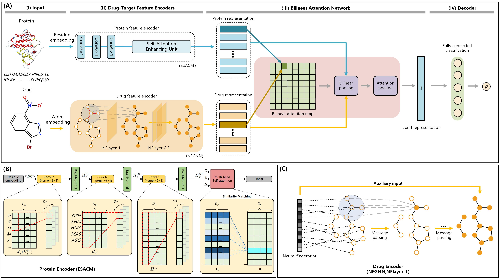

# NFSA-DTI: A Novel Drug-Target Interaction Prediction Model Using Neural Fingerprint and Self-Attention Mechanism 


## Framework

## System Requirements
The source code developed in Python 3.8 using PyTorch 1.12.0. The required python dependencies are given below. 

```
torch>=1.12.0
torchaudio>=0.12.0
torchvision>=0.13.0
torch-geometric>=1.6.0
cudatoolkit>=11.6.0
dgl>=0.9.0
dgl-cuda11.6>=0.9.1
dgllife>=0.2.8
numpy>=1.24.3
scikit-learn>=1.3.0
pandas>=2.0.0
prettytable>=3.9.0
rdkit~=2023.3.3
yacs~=0.1.8
```


## Datasets
The `datasets` folder contains all experimental data used in NFSA-DTI: [BindingDB](https://www.bindingdb.org/bind/index.jsp) [1], [BioSNAP](https://github.com/kexinhuang12345/MolTrans) [2] and [Human](https://github.com/lifanchen-simm/transformerCPI) [3]. 


## Run NFSA-DTI


 you can directly run the following command to train and valid NFSA-DTI. `dataset` could either be `bindingdb`, `biosnap` and `human`. In addition, within each respective dataset folder, one can find the model files corresponding to the optimal performance achieved specifically on that dataset.
```
python main.py --cfg "configs/NFSA-DTI.yaml" --data dataset --split random
```


